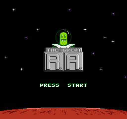
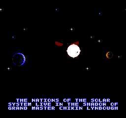
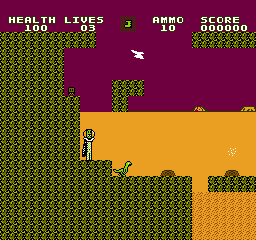
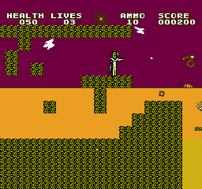

# The Great R.A.

A side-scrolling platformer/shooter for the Nintendo Entertainment System (NES), written in 6502 assembly.

<p align="left">
  
  &nbsp;&nbsp;&nbsp;
  
</p>

<p align="left">
  
  &nbsp;&nbsp;&nbsp;
  
</p>

---

## Overview

**The Great R.A.** is an in-development NES game featuring platforming, combat, and cinematic elements, built on a custom engine.

The project began as an **NROM** title (32KB PRG / 8KB CHR ROM) and is currently being migrated to **UNROM** (128KB PRG with CHR RAM), enabling expanded content and more complex systems.

The game is **playable**, with a working level, enemies, power-ups, and core engine systems in place.

---

## Current Status

* ✔ Playable level (Mars – Level 1, partial)
* ✔ Player movement and physics
* ✔ Enemy AI and interactions
* ✔ Power-up system
* ✔ Object instantiation and lifecycle management
* ✔ Sound engine (music + SFX)
* ✔ Cutscene framework (early implementation)
* ⚠ Mapper conversion in progress (NROM → UNROM)

Notes:

* Press **B** to view an early cinematic intro sequence
* Some behavior may be unstable due to ongoing bank switching work

---

## Story

The year is **2280**.  
The nations of the solar system live in the shadow of grand master **Chikin Lynbough**.  
The once prosperous Martian species codenamed **R.A.** faces extinction following the terra-nuclear disaster of **2274**.  
Nuclear fallout has caused mutations in the creatures of Mars, and has made it uninhabitable for those left.  
It has long been speculated that the disaster was no accident, and that the event was orchestrated by Chikin Lynbough to supress the advancement of the R.A. civilization.  
Now, the transport vessel carrying the three hundred R.A. survivors to Earth has gone missing.  
But there is one R.A., **RA041891**, known to still be alive, unaccounted for in the passenger logs of the vessel.  
He is wanted as the primary suspect for the ship's disappearance.  
Exhiled from society, only he knows that he is innocent, and that the warrant for his capture is part of Chikin Lynbough's plan to eliminate every last member of the R.A. species.  
He knows now what must be done. The terrible reign of Chikin Lynbough must come to an end.  
Determined to avenge the loss of R.A.-kind, RA041891 has made it his mission to defeat Chikin Lynbough and destroy his empire once and for all...

---

## Gameplay Direction

* Side-scrolling platforming and shooting
* Planet-to-planet progression across the solar system
* Increasingly hostile environments and enemy types
* Cinematic sequences integrated into gameplay

The game begins on **Mars**, with future progression moving outward and eventually back inward toward a final confrontation.

---

## Technical Highlights

This project is built on a custom engine with multiple fully implemented systems:

* Object system (spawn, update, destroy lifecycle)
* AI framework for enemies
* Player physics and movement
* Collision handling
* Audio engine (music + sound effects)
* Cutscene rendering framework
* Tool-assisted pipeline:

  * Level editor
  * Metatile editor
  * Asset workflows via `.SAV` and `.incbin`

---

## Tools

The repository includes development tools used to build game content:

* **Level Editor** – constructs level layouts using metatiles
* **Metatile Editor** – defines reusable tile structures
* Additional utilities for asset generation and pipeline support

See `/tools` for details.

---

## Build

This project uses **WLA-DX v9.3** as the assembler.

### Windows

```
build.bat
```

### Notes

* Required assembler binaries are included under `tools/`
* The project is currently transitioning to UNROM and uses bank switching
* Behavior may vary during this transition

---

## Notes

* This project is actively in development
* Core engine systems are implemented and functional
* Current focus is expanding content and completing the mapper transition
